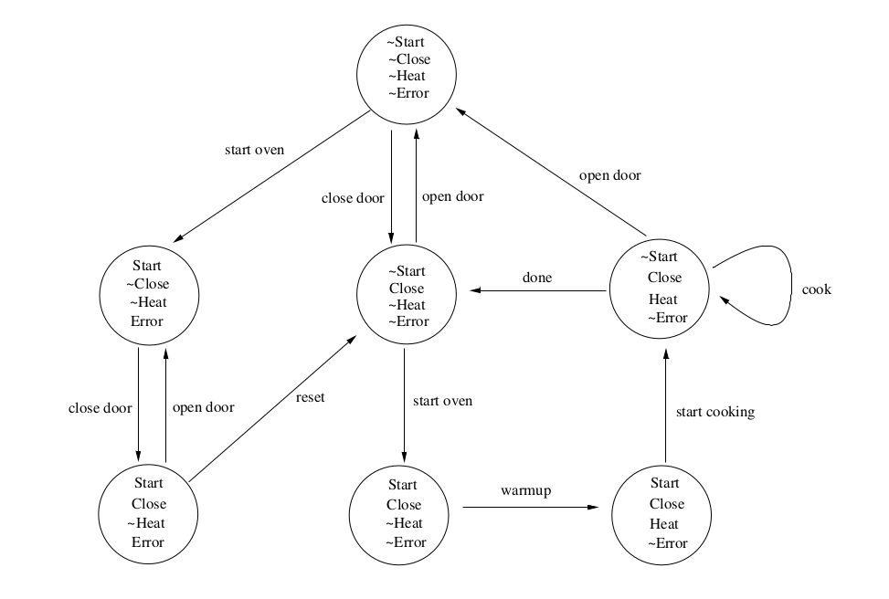

# Model Checking a Microwave Oven System

## Table of Contents
- [Introduction](#introduction)
- [Description](#description)
- [Installation](#installation)
- [Usage](#usage)

## Introduction
Model checking involves verifying if the model of a system satisfies a given set of specifications(properties). The verification is done by a model checking tool or a model checker. The one presented here is NuSMV.

## Description
To cook food in the oven, open the door, put the food inside,
and close the door. Do not put metal containers in the oven.
Press the start button. The oven will warmup for 30 seconds,
and then it will start cooking. When the cooking is done, the
oven will stop. The oven will stop also whenever the door is
opened during cooking. If the oven is started while the door is
open, an error will occur, and the oven will not heat. In such a
case, the reset button may be used.



## Installation
Download NuSVM from the [official website](https://nusmv.fbk.eu/downloads.html)

Extract the compressed file to your custom installation directory
```bash
tar –xvzf NuSMV-version-linux-distro.tar.gz –C /your/custom/installation/dir
```
Add the NuSMV binary to your path Variable
```bash
export PATH=$PATH:path/to/your/NuSMV/binary

```
## Usage
In a module file, Declare the state variables for the microwave oven system and initialise them

Define transitions from different states.

Define the specifications of the system.

Model check the system by running the model checker
```bash
NuSMV module-file.smv
```
The output returns true for all the specifications of the system if the System model is correct, otherwise, it returns a counter example, this can be due to wrong model of the system or incorrect formalization of the specifications